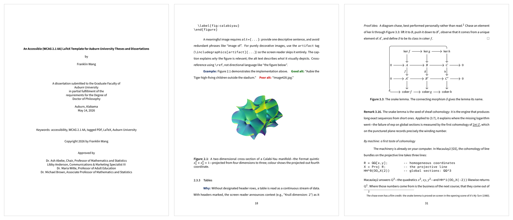

      <a href="README.md">English</a> | <b>中文</b>

<h1 align="center">Auburn University LaTeX Template (WCAG 2.1 AA)</h1>

    <em>奥本大学学位论文 LaTeX 模板（无障碍）。</em>

  
  
  
  
  
  

奥本大学官方电子学位论文（ETD）模板，编译生成**带标签、无障碍（PDF/UA-2，数学公式可被读屏朗读）** 的 PDF。用 **LuaLaTeX** 编译；所有字体已内嵌，项目完全自包含。

> 遵循 [奥本研究生院 ETD 页面](https://graduate.auburn.edu/current-students/academic-resources/etd.php) 的格式规定。

## 预览

  

## 用法

  

点上方的 **Download ZIP** 下载，上传到 **Overleaf**（New Project → Upload Project），把 **Menu → Compiler** 选 **LuaLaTeX**、**TeX Live version** 选**最新版**，再点 **Recompile**。（必须用 LuaLaTeX，pdfLaTeX / XeLaTeX 不会给 PDF 打标签。）

## 改哪些文件

- `main.tex` — 标题页信息 + 包含哪些章节
- `chapters/` · `frontmatter/` · `appendices/` — 正文内容
- `references.bib` — 参考文献（biblatex / biber）
- `figures/` — 用 `\includegraphics` 插入的图片

引擎类文件别动：

- `auburn-thesis.cls` — 文档类：版式、字体、标题、页边距，以及全部 PDF 标签（无障碍）设置
- `.latexmkrc` — 编译配置，让 `latexmk` 用 LuaLaTeX 编译并自动跑 biber 处理参考文献
- `fonts/` — 内嵌字体（含 OFL 许可证）

## 须知

- **`\chapter{...}` 标题里别用逗号** — TeX Live 2025+ 的标签引擎会误读；用冒号或破折号代替。
- **替代文字和表头行要你自己写**；其余（标题层级、MathML）都自动生成。具体见第 2 章。

## 实用资源

- [Mikael Arvola](https://github.com/marvel-uiuc) — [UIUC `uofithesis` 模板](https://github.com/graduatecollege/uofithesis)的维护者，同样基于 LaTeX 标签机制的无障碍（PDF/UA-2）学位论文模板。
- [Paul Hurtado 的 LaTeX 资源页](https://pauljhurtado.com/latex/) — 教程、速查表，以及注重无障碍的论文、作业、海报模板。

## 贡献者

